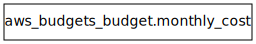

## Requirements

| Name | Version |
|------|---------|
|  [terraform](#requirement\_terraform) | >= 1.10.0 |
|  [aws](#requirement\_aws) | ~> 5.0 |

## Providers

| Name | Version |
|------|---------|
|  [aws](#provider\_aws) | 5.100.0 |

## Modules

| Name | Source | Version |
|------|--------|---------|
|  [common\_tags](#module\_common\_tags) | ../../modules/common-tags | n/a |

## Resources

| Name | Type |
|------|------|
| [aws_budgets_budget.monthly_cost](https://registry.terraform.io/providers/hashicorp/aws/latest/docs/resources/budgets_budget) | resource |

## Inputs

| Name | Description | Type | Default | Required |
|------|-------------|------|---------|:--------:|
|  [alert\_emails](#input\_alert\_emails) | Emails to receive budget alerts | `list(string)` | <pre>[   "example@example.com",   "example2@example.com" ]</pre> | no |
|  [alert\_thresholds](#input\_alert\_thresholds) | Percentages for alerts (e.g., [80, 90, 100]) | `list(number)` | <pre>[   80,   90,   100 ]</pre> | no |
|  [aws\_region](#input\_aws\_region) | AWS Region (note: Budgets API always uses us-east-1 internally) | `string` | n/a | yes |
|  [budget\_limits](#input\_budget\_limits) | Monthly budget limit in USD per environment | `map(number)` | <pre>{   "dev": 10,   "prod": 30,   "staging": 20 }</pre> | no |

## Outputs

| Name | Description |
|------|-------------|
|  [budget\_limit](#output\_budget\_limit) | Configured budget limit |
|  [budget\_name](#output\_budget\_name) | Budget name |

## Diagram

