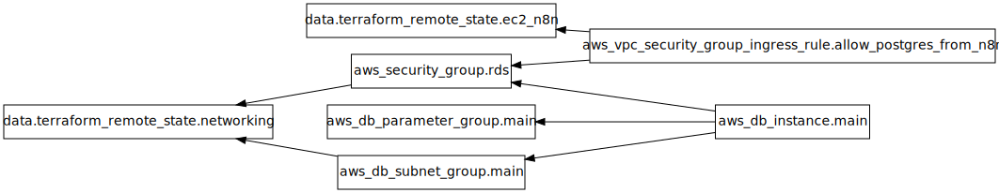

## Requirements

| Name | Version |
|------|---------|
|  [terraform](#requirement\_terraform) | >= 1.10.0 |
|  [aws](#requirement\_aws) | ~> 5.0 |

## Providers

| Name | Version |
|------|---------|
|  [aws](#provider\_aws) | 5.100.0 |
|  [terraform](#provider\_terraform) | n/a |

## Modules

| Name | Source | Version |
|------|--------|---------|
|  [common\_tags](#module\_common\_tags) | ../../modules/common-tags | n/a |

## Resources

| Name | Type |
|------|------|
| [aws_db_instance.main](https://registry.terraform.io/providers/hashicorp/aws/latest/docs/resources/db_instance) | resource |
| [aws_db_parameter_group.main](https://registry.terraform.io/providers/hashicorp/aws/latest/docs/resources/db_parameter_group) | resource |
| [aws_db_subnet_group.main](https://registry.terraform.io/providers/hashicorp/aws/latest/docs/resources/db_subnet_group) | resource |
| [aws_security_group.rds](https://registry.terraform.io/providers/hashicorp/aws/latest/docs/resources/security_group) | resource |
| [aws_vpc_security_group_ingress_rule.allow_postgres_from_n8n](https://registry.terraform.io/providers/hashicorp/aws/latest/docs/resources/vpc_security_group_ingress_rule) | resource |
| [terraform_remote_state.ec2_n8n](https://registry.terraform.io/providers/hashicorp/terraform/latest/docs/data-sources/remote_state) | data source |
| [terraform_remote_state.networking](https://registry.terraform.io/providers/hashicorp/terraform/latest/docs/data-sources/remote_state) | data source |

## Inputs

| Name | Description | Type | Default | Required |
|------|-------------|------|---------|:--------:|
|  [aws\_region](#input\_aws\_region) | AWS region | `string` | n/a | yes |
|  [db\_allocated\_storage](#input\_db\_allocated\_storage) | Allocated storage in GB per environment | `map(number)` | <pre>{   "dev": 20,   "prod": 100,   "staging": 50 }</pre> | no |
|  [db\_backup\_retention\_period](#input\_db\_backup\_retention\_period) | Backup retention period in days per environment | `map(number)` | <pre>{   "dev": 1,   "prod": 7,   "staging": 7 }</pre> | no |
|  [db\_cloudwatch\_logs\_exports](#input\_db\_cloudwatch\_logs\_exports) | List of log types to export to CloudWatch per environment | `map(list(string))` | <pre>{   "dev": [],   "prod": [     "postgresql",     "upgrade"   ],   "staging": [     "postgresql"   ] }</pre> | no |
|  [db\_deletion\_protection](#input\_db\_deletion\_protection) | Enable deletion protection per environment | `map(bool)` | <pre>{   "dev": false,   "prod": true,   "staging": false }</pre> | no |
|  [db\_engine\_version](#input\_db\_engine\_version) | PostgreSQL engine version | `string` | `"16"` | no |
|  [db\_instance\_class](#input\_db\_instance\_class) | RDS instance class per environment | `map(string)` | <pre>{   "dev": "db.t4g.micro",   "prod": "db.t4g.medium",   "staging": "db.t4g.small" }</pre> | no |
|  [db\_max\_allocated\_storage](#input\_db\_max\_allocated\_storage) | Maximum allocated storage for autoscaling in GB per environment | `map(number)` | <pre>{   "dev": 50,   "prod": 200,   "staging": 100 }</pre> | no |
|  [db\_multi\_az](#input\_db\_multi\_az) | Enable Multi-AZ deployment per environment | `map(bool)` | <pre>{   "dev": false,   "prod": true,   "staging": false }</pre> | no |
|  [db\_name](#input\_db\_name) | Name of the initial database | `string` | `"shared_db"` | no |
|  [db\_performance\_insights\_enabled](#input\_db\_performance\_insights\_enabled) | Enable Performance Insights per environment | `map(bool)` | <pre>{   "dev": false,   "prod": true,   "staging": false }</pre> | no |
|  [db\_skip\_final\_snapshot](#input\_db\_skip\_final\_snapshot) | Skip final snapshot when deleting per environment | `map(bool)` | <pre>{   "dev": true,   "prod": false,   "staging": true }</pre> | no |
|  [db\_username](#input\_db\_username) | Master username for the database | `string` | `"dbadmin"` | no |
|  [project](#input\_project) | Project name | `string` | `"rds-db"` | no |

## Outputs

| Name | Description |
|------|-------------|
|  [db\_connection\_string](#output\_db\_connection\_string) | PostgreSQL connection string template (password from Secrets Manager) |
|  [db\_endpoint](#output\_db\_endpoint) | RDS instance endpoint (hostname:port) |
|  [db\_host](#output\_db\_host) | RDS instance hostname |
|  [db\_instance\_arn](#output\_db\_instance\_arn) | RDS instance ARN |
|  [db\_instance\_id](#output\_db\_instance\_id) | RDS instance ID |
|  [db\_master\_secret\_arn](#output\_db\_master\_secret\_arn) | ARN of the Secrets Manager secret containing the master password |
|  [db\_name](#output\_db\_name) | Name of the database |
|  [db\_port](#output\_db\_port) | RDS instance port |
|  [db\_security\_group\_id](#output\_db\_security\_group\_id) | Security group ID for RDS |
|  [db\_subnet\_group\_name](#output\_db\_subnet\_group\_name) | Name of the DB subnet group |
|  [db\_username](#output\_db\_username) | Master username |

## Diagram

